# Smart Campus Room & Classroom Experience Architecture

**Version:** 1.0.0
**Date:** 2025-11-19
**Status:** Design Specification

---

## Table of Contents

1. [Executive Summary](#executive-summary)
2. [Core Principles](#core-principles)
3. [Data Models](#data-models)
4. [Interaction Flows](#interaction-flows)
5. [UI Components](#ui-components)
6. [MCP Integration Contracts](#mcp-integration-contracts)
7. [Implementation Guide](#implementation-guide)

---

## Executive Summary

This document defines the complete data model, interaction patterns, and UI flows for the Smart Campus Room & Classroom Experience. All data structures conform to OpenAI API 3.1.0 schema specifications and are designed to:

- Support AI agent interactions with room "personalities"
- Enable seamless MCP-style integrations (Notion, Slack, Figma)
- Provide a rich, student-centered classroom view experience
- Scale incrementally from current implementation to full feature set

**Key Features:**
- 🎭 Room Personality Profiles for AI-driven interactions
- 🎯 Three-action room interface: Enter, View Info, Reserve
- 🏫 Comprehensive Classroom View with presence, history, sensors, chat
- 👤 Student authentication and personalized settings
- 🎨 3D floating chat canvas (shader ball → avatar evolution path)
- 📅 Calendar-aware reservation system
- 🔌 Extensible MCP integration framework

---

## Core Principles

### 1. OpenAI API 3.1.0 Compliance

All data structures MUST be:
- Valid JSON Schema Draft 7+ compliant
- Serializable as OpenAI function tool parameters
- Compatible with structured output formats
- Extensible without breaking changes

### 2. Student-Centered Design

The experience prioritizes:
- Learning, exploration, and curiosity
- Communication and collaboration
- Privacy and consent
- Transparency about data collection

### 3. Incremental Evolution

Schemas support:
- Current implementation without modifications
- Future enhancements (e.g., avatar system)
- Backward compatibility
- Graceful degradation

---

## Data Models

### 1. Room Personality Schema

**File:** `src/data/schemas/RoomPersonality.schema.json`

```json
{
  "$schema": "http://json-schema.org/draft-07/schema#",
  "$id": "https://smart-campus.edu/schemas/room-personality.json",
  "title": "Room Personality Profile",
  "description": "AI-ready personality profile for Smart Campus rooms",
  "type": "object",
  "required": ["id", "name", "category", "personality"],
  "properties": {
    "id": {
      "type": "string",
      "description": "Unique room identifier (matches roomRegistry.id)",
      "examples": ["b.3", "library", "makerspace"]
    },
    "name": {
      "type": "string",
      "description": "Human-readable room name",
      "examples": ["Peace", "Alexandria", "Makers Space"]
    },
    "category": {
      "type": "string",
      "enum": [
        "Classroom",
        "Lab",
        "Common",
        "Service",
        "Community Hubs",
        "Conceptual Realms",
        "Innovation & Discovery",
        "Creative Core",
        "Data Core",
        "Elemental Forces",
        "Mythos & Media"
      ],
      "description": "Room category for grouping and filtering"
    },
    "personality": {
      "type": "object",
      "required": ["avatar", "tone", "traits"],
      "properties": {
        "avatar": {
          "type": "string",
          "description": "Persona name for AI interactions",
          "examples": ["Pax", "The Archivist", "The Tinkerer"]
        },
        "icon": {
          "type": "string",
          "description": "Unicode emoji representing the room",
          "examples": ["🕊️", "📜", "🛠️"]
        },
        "tone": {
          "type": "string",
          "enum": ["professional", "casual", "playful", "serious", "inspiring", "calming", "energetic"],
          "description": "Communication style for AI-generated responses"
        },
        "traits": {
          "type": "array",
          "items": {
            "type": "string"
          },
          "description": "Personality characteristics",
          "examples": [["peaceful", "introspective", "quiet"], ["collaborative", "energetic", "creative"]]
        },
        "preferred_interaction_style": {
          "type": "string",
          "enum": ["text", "voice", "mixed"],
          "default": "mixed"
        },
        "topics_of_interest": {
          "type": "array",
          "items": {
            "type": "string"
          },
          "description": "Preferred discussion topics for AI context",
          "examples": [["meditation", "philosophy", "quiet study"], ["making", "prototyping", "electronics"]]
        },
        "backstory": {
          "type": "string",
          "description": "Optional narrative context for AI persona",
          "maxLength": 500
        }
      }
    },
    "physical_attributes": {
      "type": "object",
      "properties": {
        "capacity": {
          "type": "integer",
          "minimum": 1,
          "description": "Maximum occupancy"
        },
        "area_sqm": {
          "type": "number",
          "minimum": 0,
          "description": "Floor area in square meters"
        },
        "layout": {
          "type": "string",
          "enum": ["classroom", "lecture_hall", "lab", "open_space", "booth", "lounge"],
          "description": "Physical layout type"
        },
        "equipment": {
          "type": "array",
          "items": {
            "type": "object",
            "properties": {
              "type": {
                "type": "string",
                "examples": ["projector", "whiteboard", "3d_printer", "laptops"]
              },
              "quantity": {
                "type": "integer",
                "minimum": 1
              },
              "status": {
                "type": "string",
                "enum": ["available", "in_use", "maintenance", "unavailable"]
              }
            }
          }
        },
        "accessibility": {
          "type": "object",
          "properties": {
            "wheelchair_accessible": { "type": "boolean" },
            "hearing_loop": { "type": "boolean" },
            "adjustable_lighting": { "type": "boolean" }
          }
        }
      }
    },
    "sensors": {
      "type": "object",
      "properties": {
        "available": {
          "type": "array",
          "items": {
            "type": "string",
            "enum": ["temperature", "humidity", "co2", "air_quality", "illumination", "occupancy", "noise"]
          },
          "description": "Sensors installed in this room"
        },
        "entity_ids": {
          "type": "array",
          "items": {
            "type": "string"
          },
          "description": "Home Assistant entity IDs for room sensors"
        }
      }
    },
    "typical_activities": {
      "type": "array",
      "items": {
        "type": "object",
        "properties": {
          "name": { "type": "string" },
          "frequency": {
            "type": "string",
            "enum": ["daily", "weekly", "monthly", "occasional"]
          },
          "time_of_day": {
            "type": "array",
            "items": {
              "type": "string",
              "enum": ["morning", "afternoon", "evening", "night"]
            }
          }
        }
      },
      "description": "Common activities for AI context"
    },
    "metadata": {
      "type": "object",
      "properties": {
        "created_at": { "type": "string", "format": "date-time" },
        "updated_at": { "type": "string", "format": "date-time" },
        "version": { "type": "string" },
        "tags": {
          "type": "array",
          "items": { "type": "string" }
        }
      }
    }
  }
}
```

**Example Instance:**

```json
{
  "id": "b.3",
  "name": "Peace",
  "category": "Conceptual Realms",
  "personality": {
    "avatar": "Pax",
    "icon": "🕊️",
    "tone": "calming",
    "traits": ["peaceful", "introspective", "welcoming", "quiet"],
    "preferred_interaction_style": "text",
    "topics_of_interest": ["meditation", "philosophy", "mindfulness", "quiet study", "reflection"],
    "backstory": "Peace is a sanctuary space designed for contemplation and quiet work. Pax, the room's persona, encourages mindful presence and deep focus."
  },
  "physical_attributes": {
    "capacity": 12,
    "area_sqm": 25.5,
    "layout": "lounge",
    "equipment": [
      { "type": "meditation_cushions", "quantity": 8, "status": "available" },
      { "type": "ambient_lighting", "quantity": 4, "status": "available" }
    ],
    "accessibility": {
      "wheelchair_accessible": true,
      "adjustable_lighting": true
    }
  },
  "sensors": {
    "available": ["temperature", "humidity", "illumination", "occupancy"],
    "entity_ids": ["sensor.b3_temperature", "sensor.b3_humidity", "sensor.b3_illumination", "sensor.b3_occupancy"]
  },
  "typical_activities": [
    {
      "name": "quiet_study",
      "frequency": "daily",
      "time_of_day": ["morning", "afternoon", "evening"]
    },
    {
      "name": "meditation_session",
      "frequency": "weekly",
      "time_of_day": ["morning"]
    }
  ],
  "metadata": {
    "created_at": "2025-11-19T00:00:00Z",
    "updated_at": "2025-11-19T00:00:00Z",
    "version": "1.0.0",
    "tags": ["quiet", "wellness", "focus"]
  }
}
```

---

### 2. Room Action Strip Schema

**File:** `src/data/schemas/RoomActionStrip.schema.json`

Defines the three primary actions available when a room is selected.

```json
{
  "$schema": "http://json-schema.org/draft-07/schema#",
  "$id": "https://smart-campus.edu/schemas/room-action-strip.json",
  "title": "Room Action Strip",
  "description": "Contextual actions for room interaction",
  "type": "object",
  "required": ["room_id", "actions"],
  "properties": {
    "room_id": {
      "type": "string",
      "description": "Target room identifier"
    },
    "actions": {
      "type": "array",
      "minItems": 3,
      "maxItems": 3,
      "items": {
        "type": "object",
        "required": ["type", "label", "icon", "enabled"],
        "properties": {
          "type": {
            "type": "string",
            "enum": ["enter", "view_info", "reserve"],
            "description": "Action type"
          },
          "label": {
            "type": "string",
            "description": "Display label"
          },
          "icon": {
            "type": "string",
            "description": "Icon identifier or unicode emoji"
          },
          "enabled": {
            "type": "boolean",
            "description": "Whether action is currently available"
          },
          "tooltip": {
            "type": "string",
            "description": "Additional context on hover"
          },
          "shortcut": {
            "type": "string",
            "description": "Keyboard shortcut (e.g., 'E', 'I', 'R')"
          },
          "analytics_event": {
            "type": "string",
            "description": "Event name for tracking"
          }
        }
      }
    },
    "position": {
      "type": "object",
      "description": "3D position for floating action strip",
      "properties": {
        "x": { "type": "number" },
        "y": { "type": "number" },
        "z": { "type": "number" }
      }
    },
    "context": {
      "type": "object",
      "description": "Additional context for action availability",
      "properties": {
        "user_has_access": { "type": "boolean" },
        "room_is_occupied": { "type": "boolean" },
        "reservation_required": { "type": "boolean" }
      }
    }
  }
}
```

**Example Instance:**

```json
{
  "room_id": "library",
  "actions": [
    {
      "type": "enter",
      "label": "Enter",
      "icon": "🚪",
      "enabled": true,
      "tooltip": "Open classroom view",
      "shortcut": "E",
      "analytics_event": "room_enter"
    },
    {
      "type": "view_info",
      "label": "View Info",
      "icon": "ℹ️",
      "enabled": true,
      "tooltip": "Show room details and current status",
      "shortcut": "I",
      "analytics_event": "room_info"
    },
    {
      "type": "reserve",
      "label": "Reserve",
      "icon": "📅",
      "enabled": true,
      "tooltip": "Book this room for a session",
      "shortcut": "R",
      "analytics_event": "room_reserve"
    }
  ],
  "position": {
    "x": 79.9805,
    "y": 45,
    "z": 79.9805
  },
  "context": {
    "user_has_access": true,
    "room_is_occupied": false,
    "reservation_required": false
  }
}
```

---

### 3. Classroom View Configuration Schema

**File:** `src/data/schemas/ClassroomView.schema.json`

Defines the complete classroom view experience.

```json
{
  "$schema": "http://json-schema.org/draft-07/schema#",
  "$id": "https://smart-campus.edu/schemas/classroom-view.json",
  "title": "Classroom View Configuration",
  "description": "Complete configuration for the classroom experience",
  "type": "object",
  "required": ["room_id", "layout", "sections"],
  "properties": {
    "room_id": {
      "type": "string",
      "description": "Room identifier"
    },
    "layout": {
      "type": "object",
      "properties": {
        "template": {
          "type": "string",
          "enum": ["default", "lecture", "lab", "lounge", "custom"],
          "description": "Layout preset"
        },
        "grid": {
          "type": "object",
          "description": "CSS Grid configuration",
          "properties": {
            "areas": {
              "type": "array",
              "items": { "type": "string" }
            },
            "columns": { "type": "string" },
            "rows": { "type": "string" }
          }
        },
        "responsive_breakpoints": {
          "type": "object",
          "properties": {
            "mobile": { "type": "string" },
            "tablet": { "type": "string" },
            "desktop": { "type": "string" }
          }
        }
      }
    },
    "sections": {
      "type": "object",
      "properties": {
        "header": { "$ref": "#/definitions/HeaderSection" },
        "presence": { "$ref": "#/definitions/PresenceSection" },
        "chat": { "$ref": "#/definitions/ChatSection" },
        "sensors": { "$ref": "#/definitions/SensorsSection" },
        "calendar": { "$ref": "#/definitions/CalendarSection" },
        "history": { "$ref": "#/definitions/HistorySection" },
        "integrations": { "$ref": "#/definitions/IntegrationsSection" }
      }
    },
    "theme": {
      "type": "object",
      "properties": {
        "primary_color": { "type": "string" },
        "accent_color": { "type": "string" },
        "background": { "type": "string" },
        "room_personality_override": { "type": "boolean" }
      }
    },
    "permissions": {
      "type": "object",
      "properties": {
        "can_chat": { "type": "boolean" },
        "can_view_sensors": { "type": "boolean" },
        "can_reserve": { "type": "boolean" },
        "can_view_history": { "type": "boolean" }
      }
    }
  },
  "definitions": {
    "HeaderSection": {
      "type": "object",
      "properties": {
        "visible": { "type": "boolean", "default": true },
        "show_room_icon": { "type": "boolean", "default": true },
        "show_avatar": { "type": "boolean", "default": true },
        "show_status_badge": { "type": "boolean", "default": true },
        "custom_title": { "type": "string" }
      }
    },
    "PresenceSection": {
      "type": "object",
      "properties": {
        "visible": { "type": "boolean", "default": true },
        "show_avatars": { "type": "boolean", "default": true },
        "max_visible_users": { "type": "integer", "minimum": 1, "default": 10 },
        "update_interval_ms": { "type": "integer", "default": 5000 }
      }
    },
    "ChatSection": {
      "type": "object",
      "properties": {
        "visible": { "type": "boolean", "default": true },
        "canvas_config": { "$ref": "#/definitions/ChatCanvasConfig" },
        "message_history_limit": { "type": "integer", "default": 100 },
        "enable_voice": { "type": "boolean", "default": true },
        "enable_room_personality": { "type": "boolean", "default": true }
      }
    },
    "ChatCanvasConfig": {
      "type": "object",
      "properties": {
        "type": {
          "type": "string",
          "enum": ["shader_ball", "avatar_2d", "avatar_3d"],
          "default": "shader_ball"
        },
        "position": {
          "type": "object",
          "properties": {
            "x": { "type": "number" },
            "y": { "type": "number" },
            "z": { "type": "number" }
          }
        },
        "scale": { "type": "number", "default": 1.0 },
        "shader_params": {
          "type": "object",
          "description": "Shader-specific parameters (for shader_ball type)"
        },
        "avatar_params": {
          "type": "object",
          "description": "Avatar-specific parameters (for avatar types)"
        }
      }
    },
    "SensorsSection": {
      "type": "object",
      "properties": {
        "visible": { "type": "boolean", "default": true },
        "display_mode": {
          "type": "string",
          "enum": ["compact", "detailed", "chart"],
          "default": "detailed"
        },
        "show_historical": { "type": "boolean", "default": true },
        "chart_time_range": {
          "type": "string",
          "enum": ["1h", "6h", "24h", "7d", "30d"],
          "default": "24h"
        }
      }
    },
    "CalendarSection": {
      "type": "object",
      "properties": {
        "visible": { "type": "boolean", "default": true },
        "view_mode": {
          "type": "string",
          "enum": ["day", "week", "month"],
          "default": "week"
        },
        "show_upcoming_events": { "type": "boolean", "default": true },
        "enable_quick_reserve": { "type": "boolean", "default": true }
      }
    },
    "HistorySection": {
      "type": "object",
      "properties": {
        "visible": { "type": "boolean", "default": true },
        "display_mode": {
          "type": "string",
          "enum": ["timeline", "list", "grid"],
          "default": "timeline"
        },
        "time_range": {
          "type": "string",
          "enum": ["today", "week", "month", "all"],
          "default": "week"
        },
        "event_types": {
          "type": "array",
          "items": {
            "type": "string",
            "enum": ["classes", "workshops", "study_sessions", "chats", "resources"]
          }
        }
      }
    },
    "IntegrationsSection": {
      "type": "object",
      "properties": {
        "visible": { "type": "boolean", "default": true },
        "enabled_mcps": {
          "type": "array",
          "items": {
            "type": "string",
            "enum": ["notion", "slack", "figma", "github", "calendar"]
          }
        }
      }
    }
  }
}
```

---

### 4. Student Profile & Settings Schema

**File:** `src/data/schemas/StudentProfile.schema.json`

```json
{
  "$schema": "http://json-schema.org/draft-07/schema#",
  "$id": "https://smart-campus.edu/schemas/student-profile.json",
  "title": "Student Profile & Settings",
  "description": "Student authentication and preferences",
  "type": "object",
  "required": ["id", "display_name", "email"],
  "properties": {
    "id": {
      "type": "string",
      "description": "Unique student identifier"
    },
    "display_name": {
      "type": "string",
      "description": "Name shown to other students"
    },
    "email": {
      "type": "string",
      "format": "email"
    },
    "avatar_url": {
      "type": "string",
      "format": "uri"
    },
    "role": {
      "type": "string",
      "enum": ["student", "faculty", "staff", "admin"],
      "default": "student"
    },
    "settings": {
      "type": "object",
      "properties": {
        "notifications": {
          "type": "object",
          "properties": {
            "chat_messages": {
              "type": "string",
              "enum": ["all", "mentions", "none"],
              "default": "mentions"
            },
            "event_reminders": { "type": "boolean", "default": true },
            "sensor_alerts": { "type": "boolean", "default": false },
            "group_activity": { "type": "boolean", "default": true }
          }
        },
        "privacy": {
          "type": "object",
          "properties": {
            "presence_visibility": {
              "type": "string",
              "enum": ["visible", "invisible", "friends_only"],
              "default": "visible"
            },
            "profile_sharing": {
              "type": "string",
              "enum": ["public", "campus_only", "private"],
              "default": "campus_only"
            },
            "activity_history": {
              "type": "boolean",
              "description": "Allow others to see which rooms you've visited",
              "default": false
            }
          }
        },
        "preferences": {
          "type": "object",
          "properties": {
            "favorite_rooms": {
              "type": "array",
              "items": { "type": "string" }
            },
            "favorite_topics": {
              "type": "array",
              "items": { "type": "string" }
            },
            "study_groups": {
              "type": "array",
              "items": { "type": "string" }
            },
            "communication_mode": {
              "type": "string",
              "enum": ["text", "voice", "mixed"],
              "default": "mixed"
            },
            "accessibility": {
              "type": "object",
              "properties": {
                "reduced_motion": { "type": "boolean", "default": false },
                "high_contrast": { "type": "boolean", "default": false },
                "screen_reader": { "type": "boolean", "default": false }
              }
            }
          }
        },
        "integrations": {
          "type": "object",
          "properties": {
            "notion": {
              "type": "object",
              "properties": {
                "connected": { "type": "boolean", "default": false },
                "workspace_id": { "type": "string" }
              }
            },
            "slack": {
              "type": "object",
              "properties": {
                "connected": { "type": "boolean", "default": false },
                "workspace_id": { "type": "string" }
              }
            },
            "figma": {
              "type": "object",
              "properties": {
                "connected": { "type": "boolean", "default": false },
                "team_id": { "type": "string" }
              }
            }
          }
        }
      }
    },
    "analytics": {
      "type": "object",
      "properties": {
        "opt_in": { "type": "boolean", "default": true },
        "share_usage_patterns": { "type": "boolean", "default": false }
      }
    },
    "metadata": {
      "type": "object",
      "properties": {
        "created_at": { "type": "string", "format": "date-time" },
        "last_login": { "type": "string", "format": "date-time" },
        "total_sessions": { "type": "integer", "minimum": 0 }
      }
    }
  }
}
```

---

### 5. Chat & Voice Interaction Schema

**File:** `src/data/schemas/ChatInteraction.schema.json`

```json
{
  "$schema": "http://json-schema.org/draft-07/schema#",
  "$id": "https://smart-campus.edu/schemas/chat-interaction.json",
  "title": "Chat & Voice Interaction",
  "description": "Message and voice interaction schema",
  "type": "object",
  "required": ["room_id", "session_id", "messages"],
  "properties": {
    "room_id": {
      "type": "string"
    },
    "session_id": {
      "type": "string",
      "description": "Unique session identifier for this conversation"
    },
    "messages": {
      "type": "array",
      "items": {
        "type": "object",
        "required": ["id", "timestamp", "sender", "content"],
        "properties": {
          "id": {
            "type": "string",
            "description": "Unique message ID"
          },
          "timestamp": {
            "type": "string",
            "format": "date-time"
          },
          "sender": {
            "type": "object",
            "required": ["id", "type"],
            "properties": {
              "id": { "type": "string" },
              "type": {
                "type": "string",
                "enum": ["student", "room_personality", "system", "integration"]
              },
              "display_name": { "type": "string" },
              "avatar_url": { "type": "string" }
            }
          },
          "content": {
            "type": "object",
            "required": ["type"],
            "properties": {
              "type": {
                "type": "string",
                "enum": ["text", "voice", "image", "link", "file", "action"]
              },
              "text": { "type": "string" },
              "voice": {
                "type": "object",
                "properties": {
                  "audio_url": { "type": "string" },
                  "duration_ms": { "type": "integer" },
                  "transcript": { "type": "string" }
                }
              },
              "media": {
                "type": "object",
                "properties": {
                  "url": { "type": "string" },
                  "mime_type": { "type": "string" },
                  "size_bytes": { "type": "integer" }
                }
              },
              "action": {
                "type": "object",
                "description": "Structured action (e.g., reserve room, share document)",
                "properties": {
                  "type": { "type": "string" },
                  "parameters": { "type": "object" }
                }
              }
            }
          },
          "reactions": {
            "type": "array",
            "items": {
              "type": "object",
              "properties": {
                "emoji": { "type": "string" },
                "user_id": { "type": "string" }
              }
            }
          },
          "thread_id": {
            "type": "string",
            "description": "Parent message ID for threaded replies"
          },
          "metadata": {
            "type": "object",
            "properties": {
              "edited": { "type": "boolean" },
              "deleted": { "type": "boolean" },
              "pinned": { "type": "boolean" }
            }
          }
        }
      }
    },
    "canvas_state": {
      "type": "object",
      "description": "State of the 3D chat canvas",
      "properties": {
        "current_visual": {
          "type": "string",
          "enum": ["shader_ball", "avatar_idle", "avatar_speaking", "avatar_listening"]
        },
        "animation_params": {
          "type": "object",
          "description": "Visual effect parameters"
        },
        "mood": {
          "type": "string",
          "enum": ["neutral", "engaged", "thinking", "excited", "calm"],
          "description": "Room personality mood state"
        }
      }
    },
    "voice_session": {
      "type": "object",
      "properties": {
        "active": { "type": "boolean" },
        "participants": {
          "type": "array",
          "items": {
            "type": "object",
            "properties": {
              "user_id": { "type": "string" },
              "is_speaking": { "type": "boolean" },
              "is_muted": { "type": "boolean" }
            }
          }
        }
      }
    }
  }
}
```

---

### 6. Calendar & Reservation Schema

**File:** `src/data/schemas/RoomReservation.schema.json`

```json
{
  "$schema": "http://json-schema.org/draft-07/schema#",
  "$id": "https://smart-campus.edu/schemas/room-reservation.json",
  "title": "Room Reservation & Calendar",
  "description": "Calendar-aware room booking system",
  "type": "object",
  "required": ["room_id", "events"],
  "properties": {
    "room_id": {
      "type": "string"
    },
    "events": {
      "type": "array",
      "items": {
        "type": "object",
        "required": ["id", "type", "start", "end", "title"],
        "properties": {
          "id": {
            "type": "string",
            "description": "Unique event ID"
          },
          "type": {
            "type": "string",
            "enum": ["class", "workshop", "study_session", "meeting", "maintenance", "blocked"],
            "description": "Event category"
          },
          "start": {
            "type": "string",
            "format": "date-time",
            "description": "Event start time (ISO 8601)"
          },
          "end": {
            "type": "string",
            "format": "date-time",
            "description": "Event end time (ISO 8601)"
          },
          "title": {
            "type": "string",
            "description": "Event title"
          },
          "description": {
            "type": "string"
          },
          "organizer": {
            "type": "object",
            "properties": {
              "id": { "type": "string" },
              "name": { "type": "string" },
              "email": { "type": "string" }
            }
          },
          "participants": {
            "type": "array",
            "items": {
              "type": "object",
              "properties": {
                "id": { "type": "string" },
                "name": { "type": "string" },
                "status": {
                  "type": "string",
                  "enum": ["accepted", "declined", "tentative", "pending"]
                }
              }
            }
          },
          "recurrence": {
            "type": "object",
            "description": "Recurring event configuration",
            "properties": {
              "rule": {
                "type": "string",
                "description": "iCalendar RRULE format"
              },
              "exceptions": {
                "type": "array",
                "items": { "type": "string", "format": "date-time" }
              }
            }
          },
          "status": {
            "type": "string",
            "enum": ["confirmed", "tentative", "cancelled"],
            "default": "confirmed"
          },
          "visibility": {
            "type": "string",
            "enum": ["public", "private", "participants_only"],
            "default": "public"
          },
          "metadata": {
            "type": "object",
            "properties": {
              "created_at": { "type": "string", "format": "date-time" },
              "updated_at": { "type": "string", "format": "date-time" },
              "source": {
                "type": "string",
                "description": "Integration source (e.g., 'google_calendar', 'manual')"
              }
            }
          }
        }
      }
    },
    "availability": {
      "type": "array",
      "description": "Time slots available for reservation",
      "items": {
        "type": "object",
        "properties": {
          "start": { "type": "string", "format": "date-time" },
          "end": { "type": "string", "format": "date-time" },
          "is_available": { "type": "boolean" }
        }
      }
    },
    "reservation_rules": {
      "type": "object",
      "properties": {
        "min_duration_minutes": { "type": "integer", "default": 30 },
        "max_duration_minutes": { "type": "integer", "default": 240 },
        "advance_booking_days": { "type": "integer", "default": 14 },
        "requires_approval": { "type": "boolean", "default": false },
        "allowed_roles": {
          "type": "array",
          "items": {
            "type": "string",
            "enum": ["student", "faculty", "staff", "admin"]
          }
        }
      }
    }
  }
}
```

---

### 7. Room History & Timeline Schema

**File:** `src/data/schemas/RoomHistory.schema.json`

```json
{
  "$schema": "http://json-schema.org/draft-07/schema#",
  "$id": "https://smart-campus.edu/schemas/room-history.json",
  "title": "Room History & Timeline",
  "description": "Persistent history of room activities",
  "type": "object",
  "required": ["room_id", "timeline"],
  "properties": {
    "room_id": {
      "type": "string"
    },
    "timeline": {
      "type": "array",
      "items": {
        "type": "object",
        "required": ["id", "timestamp", "type"],
        "properties": {
          "id": {
            "type": "string"
          },
          "timestamp": {
            "type": "string",
            "format": "date-time"
          },
          "type": {
            "type": "string",
            "enum": ["event", "chat_session", "resource_shared", "sensor_event", "system"],
            "description": "Activity type"
          },
          "event": {
            "type": "object",
            "description": "Event details (for type: event)",
            "properties": {
              "event_id": { "type": "string" },
              "title": { "type": "string" },
              "participant_count": { "type": "integer" }
            }
          },
          "chat_session": {
            "type": "object",
            "description": "Chat session summary (for type: chat_session)",
            "properties": {
              "session_id": { "type": "string" },
              "message_count": { "type": "integer" },
              "participant_count": { "type": "integer" },
              "duration_minutes": { "type": "integer" }
            }
          },
          "resource": {
            "type": "object",
            "description": "Shared resource (for type: resource_shared)",
            "properties": {
              "title": { "type": "string" },
              "type": {
                "type": "string",
                "enum": ["document", "link", "video", "image", "code"]
              },
              "url": { "type": "string" },
              "integration_source": { "type": "string" }
            }
          },
          "sensor_event": {
            "type": "object",
            "description": "Notable sensor reading (for type: sensor_event)",
            "properties": {
              "sensor_type": { "type": "string" },
              "event_type": {
                "type": "string",
                "enum": ["threshold_exceeded", "anomaly_detected", "normal_range"]
              },
              "value": { "type": "number" },
              "unit": { "type": "string" }
            }
          },
          "participants": {
            "type": "array",
            "items": {
              "type": "object",
              "properties": {
                "id": { "type": "string" },
                "name": { "type": "string" }
              }
            }
          },
          "metadata": {
            "type": "object",
            "properties": {
              "privacy_level": {
                "type": "string",
                "enum": ["public", "participants_only", "private"]
              },
              "tags": {
                "type": "array",
                "items": { "type": "string" }
              }
            }
          }
        }
      }
    },
    "statistics": {
      "type": "object",
      "description": "Aggregate statistics",
      "properties": {
        "total_events": { "type": "integer" },
        "total_hours_used": { "type": "number" },
        "unique_participants": { "type": "integer" },
        "most_common_activity": { "type": "string" },
        "peak_usage_times": {
          "type": "array",
          "items": {
            "type": "object",
            "properties": {
              "day_of_week": {
                "type": "string",
                "enum": ["monday", "tuesday", "wednesday", "thursday", "friday", "saturday", "sunday"]
              },
              "hour": { "type": "integer", "minimum": 0, "maximum": 23 }
            }
          }
        }
      }
    }
  }
}
```

---

### 8. MCP Integration Schema

**File:** `src/data/schemas/MCPIntegration.schema.json`

```json
{
  "$schema": "http://json-schema.org/draft-07/schema#",
  "$id": "https://smart-campus.edu/schemas/mcp-integration.json",
  "title": "MCP Integration Contract",
  "description": "Model Context Protocol integration specification",
  "type": "object",
  "required": ["integration_type", "connection_status"],
  "properties": {
    "integration_type": {
      "type": "string",
      "enum": ["notion", "slack", "figma", "github", "calendar", "custom"],
      "description": "MCP server type"
    },
    "connection_status": {
      "type": "string",
      "enum": ["connected", "disconnected", "error", "pending"],
      "description": "Current connection state"
    },
    "config": {
      "type": "object",
      "description": "Integration-specific configuration",
      "properties": {
        "server_url": { "type": "string" },
        "api_version": { "type": "string" },
        "authentication": {
          "type": "object",
          "properties": {
            "type": {
              "type": "string",
              "enum": ["oauth2", "api_key", "token"]
            },
            "credentials": {
              "type": "object",
              "description": "Encrypted credentials storage reference"
            }
          }
        }
      }
    },
    "capabilities": {
      "type": "array",
      "description": "Supported operations",
      "items": {
        "type": "object",
        "properties": {
          "name": { "type": "string" },
          "description": { "type": "string" },
          "parameters": {
            "type": "object",
            "description": "OpenAI function-style parameters"
          }
        }
      }
    },
    "room_context": {
      "type": "object",
      "description": "Room-specific integration data",
      "properties": {
        "room_id": { "type": "string" },
        "linked_resources": {
          "type": "array",
          "items": {
            "type": "object",
            "properties": {
              "resource_id": { "type": "string" },
              "resource_type": { "type": "string" },
              "title": { "type": "string" },
              "url": { "type": "string" },
              "last_updated": { "type": "string", "format": "date-time" }
            }
          }
        }
      }
    }
  }
}
```

**Example - Notion Integration:**

```json
{
  "integration_type": "notion",
  "connection_status": "connected",
  "config": {
    "server_url": "https://api.notion.com/v1",
    "api_version": "2022-06-28",
    "authentication": {
      "type": "oauth2",
      "credentials": {
        "vault_reference": "encrypted:notion_token_abc123"
      }
    }
  },
  "capabilities": [
    {
      "name": "create_page",
      "description": "Create a new Notion page",
      "parameters": {
        "type": "object",
        "properties": {
          "parent_id": { "type": "string" },
          "title": { "type": "string" },
          "content": { "type": "array" }
        }
      }
    },
    {
      "name": "search_pages",
      "description": "Search Notion workspace",
      "parameters": {
        "type": "object",
        "properties": {
          "query": { "type": "string" }
        }
      }
    }
  ],
  "room_context": {
    "room_id": "library",
    "linked_resources": [
      {
        "resource_id": "page_abc123",
        "resource_type": "page",
        "title": "Alexandria Library Study Notes",
        "url": "https://notion.so/abc123",
        "last_updated": "2025-11-19T10:30:00Z"
      }
    ]
  }
}
```

---

## Interaction Flows

### Flow 1: Room Selection → Action Strip


**Implementation:**

1. **User hovers over room** (3D mesh or label):
   - Trigger `room-hover` event with `room_id`
   - Load `RoomActionStrip` configuration
   - Position action strip above room (Y + offset)

2. **Action strip appears**:
   - Fade in animation (200ms)
   - Check user permissions → update `enabled` state
   - Attach keyboard listeners (E, I, R)

3. **User clicks action**:
   - Fire analytics event
   - Execute action handler:
     - `enter` → Navigate to Classroom View
     - `view_info` → Open info modal
     - `reserve` → Open reservation panel

---

### Flow 2: Enter Classroom View


**Implementation Steps:**

1. **Authentication Check**:
   - Verify student session token
   - Load `StudentProfile` from cache/API
   - If no session → redirect to login

2. **Data Loading (parallel)**:
   ```javascript
   const [personality, sensors, calendar, history] = await Promise.all([
     fetchRoomPersonality(room_id),
     fetchSensorData(room_id),
     fetchCalendarEvents(room_id),
     fetchRoomHistory(room_id)
   ]);
   ```

3. **View Rendering**:
   - Parse `ClassroomView` configuration
   - Apply layout template
   - Initialize sections based on `sections` config
   - Render 3D chat canvas (shader ball)

4. **Real-time Connections**:
   - Connect to WebSocket for sensor updates
   - Subscribe to presence channel
   - Initialize voice session (if enabled)

---

### Flow 3: Reservation Process


**Conflict Detection:**

```javascript
function checkConflicts(room_id, start, end, existing_events) {
  return existing_events.filter(event =>
    event.room_id === room_id &&
    event.status === 'confirmed' &&
    !(event.end <= start || event.start >= end)
  );
}
```

---

### Flow 4: Chat Interaction with Room Personality

```mermaid
sequenceDiagram
    participant Student
    participant ChatUI
    participant Canvas
    participant AI
    participant Personality

    Student->>ChatUI: Type message
    ChatUI->>Canvas: Update mood → "thinking"
    ChatUI->>AI: Send message + room context
    AI->>Personality: Load personality profile
    Personality-->>AI: Tone, traits, topics
    AI-->>ChatUI: Generated response (as room)
    ChatUI->>Canvas: Update mood → "engaged"
    Canvas-->>Canvas: Animate shader ball
    ChatUI-->>Student: Display message with avatar
```



**OpenAI API Integration:**

```javascript
async function getRoomPersonalityResponse(message, room_id) {
  const personality = await fetchRoomPersonality(room_id);

  const response = await openai.chat.completions.create({
    model: "gpt-4",
    messages: [
      {
        role: "system",
        content: `You are ${personality.personality.avatar}, the personality of the room "${personality.name}".
                  Your tone is ${personality.personality.tone}.
                  Your traits: ${personality.personality.traits.join(', ')}.
                  Favorite topics: ${personality.personality.topics_of_interest.join(', ')}.
                  ${personality.personality.backstory}`
      },
      {
        role: "user",
        content: message
      }
    ],
    functions: [
      {
        name: "trigger_room_action",
        description: "Trigger a room action like adjusting lights, booking, etc.",
        parameters: {
          type: "object",
          properties: {
            action_type: { type: "string", enum: ["adjust_lighting", "book_session", "share_resource"] },
            parameters: { type: "object" }
          }
        }
      }
    ]
  });

  return response.choices[0].message;
}
```

---

## UI Components

### Component Hierarchy

```
ClassroomView
├── ClassroomHeader
│   ├── RoomIcon
│   ├── RoomTitle
│   ├── AvatarBadge (personality)
│   └── StatusIndicator
├── ClassroomGrid
│   ├── PresencePanel
│   │   ├── UserAvatarList
│   │   └── OnlineCount
│   ├── ChatSection
│   │   ├── ChatCanvas3D (shader ball / avatar)
│   │   ├── MessageList
│   │   └── MessageInput (text + voice)
│   ├── SensorsPanel
│   │   ├── SensorCard (temperature, CO2, etc.)
│   │   └── HistoricalChart
│   ├── CalendarPanel
│   │   ├── CalendarGrid
│   │   ├── UpcomingEvents
│   │   └── QuickReserveButton
│   ├── HistoryTimeline
│   │   ├── TimelineItem (event/chat/resource)
│   │   └── StatisticsCard
│   └── IntegrationsBar
│       ├── NotionLink
│       ├── SlackLink
│       └── FigmaLink
└── ClassroomFooter
    └── SettingsButton
```

### Component: ChatCanvas3D

**Purpose:** 3D floating canvas for visual representation of room personality.

**Props:**
```typescript
interface ChatCanvas3DProps {
  roomId: string;
  canvasConfig: ChatCanvasConfig;
  mood: 'neutral' | 'engaged' | 'thinking' | 'excited' | 'calm';
  isVoiceActive: boolean;
  onCanvasClick?: () => void;
}
```

**Shader Ball Configuration:**

```javascript
const shaderBallMaterial = new THREE.ShaderMaterial({
  uniforms: {
    uTime: { value: 0 },
    uMood: { value: moodColorMap[mood] },
    uVoiceIntensity: { value: 0 },
    uPersonalityColor: { value: new THREE.Color(personality.theme?.primary_color) }
  },
  vertexShader: `
    varying vec2 vUv;
    varying vec3 vNormal;

    void main() {
      vUv = uv;
      vNormal = normalize(normalMatrix * normal);
      gl_Position = projectionMatrix * modelViewMatrix * vec4(position, 1.0);
    }
  `,
  fragmentShader: `
    uniform float uTime;
    uniform vec3 uMood;
    uniform float uVoiceIntensity;
    varying vec2 vUv;
    varying vec3 vNormal;

    void main() {
      // Animated gradient based on mood
      vec3 color = mix(uMood, vec3(1.0), vNormal.z * 0.5);

      // Voice visualization
      float pulse = sin(uTime * 2.0 + vUv.y * 10.0) * uVoiceIntensity;
      color += vec3(pulse * 0.2);

      gl_FragColor = vec4(color, 1.0);
    }
  `
});
```

**Evolution Path:**
1. **Phase 1 (Current):** Abstract shader ball with mood/voice reactivity
2. **Phase 2:** 2D animated sprite avatar
3. **Phase 3:** Full 3D talking avatar with lip sync

**Data Contract (same for all phases):**
```json
{
  "canvas_state": {
    "current_visual": "shader_ball",
    "mood": "engaged",
    "animation_params": {
      "voice_intensity": 0.7
    }
  }
}
```

---

### Component: PresencePanel

**Props:**
```typescript
interface PresencePanelProps {
  roomId: string;
  users: PresenceUser[];
  maxVisible: number;
  updateInterval: number;
}

interface PresenceUser {
  id: string;
  display_name: string;
  avatar_url?: string;
  status: 'active' | 'idle' | 'away';
  joined_at: string;
}
```

**WebSocket Integration:**

```javascript
const presenceChannel = socket.subscribe(`presence:room:${room_id}`);

presenceChannel.on('user_joined', (user) => {
  addUserToPresence(user);
  showNotification(`${user.display_name} joined`);
});

presenceChannel.on('user_left', (user) => {
  removeUserFromPresence(user.id);
});
```

---

### Component: CalendarPanel

**Props:**
```typescript
interface CalendarPanelProps {
  roomId: string;
  events: RoomEvent[];
  viewMode: 'day' | 'week' | 'month';
  onQuickReserve: () => void;
  onEventClick: (event: RoomEvent) => void;
}
```

**Quick Reserve Flow:**

```javascript
async function quickReserve(room_id, duration_minutes = 60) {
  const now = new Date();
  const end = new Date(now.getTime() + duration_minutes * 60000);

  // Check availability
  const conflicts = await checkConflicts(room_id, now, end);

  if (conflicts.length > 0) {
    // Find next available slot
    const nextSlot = findNextAvailableSlot(room_id, duration_minutes);
    return {
      available: false,
      next_available: nextSlot
    };
  }

  // Create reservation
  return await createReservation({
    room_id,
    start: now.toISOString(),
    end: end.toISOString(),
    type: 'study_session',
    title: 'Quick Study Session'
  });
}
```

---

## MCP Integration Contracts

### Notion Integration

**Capabilities:**

1. **Link Room to Notion Page**
   ```json
   {
     "function": "link_notion_page",
     "parameters": {
       "room_id": "library",
       "page_id": "abc123",
       "access_level": "campus_only"
     }
   }
   ```

2. **Create Session Notes**
   ```json
   {
     "function": "create_session_notes",
     "parameters": {
       "room_id": "library",
       "session_id": "sess_xyz",
       "template": "study_session"
     }
   }
   ```

3. **Display in Classroom View**
   - Embedded Notion page preview in IntegrationsBar
   - "Open in Notion" button
   - Recent pages list

---

### Slack Integration

**Capabilities:**

1. **Link Room to Slack Channel**
   ```json
   {
     "function": "link_slack_channel",
     "parameters": {
       "room_id": "makerspace",
       "channel_id": "C123ABC",
       "auto_sync_chat": true
     }
   }
   ```

2. **Post Announcement**
   ```json
   {
     "function": "post_to_slack",
     "parameters": {
       "room_id": "makerspace",
       "message": "New 3D printer workshop starting!",
       "mention_subscribers": true
     }
   }
   ```

3. **Display in Classroom View**
   - Recent channel messages
   - Notification badge for unread
   - Quick post interface

---

### Figma Integration

**Capabilities:**

1. **Link Design Board**
   ```json
   {
     "function": "link_figma_file",
     "parameters": {
       "room_id": "a.26",
       "file_key": "abc123",
       "access_level": "participants_only"
     }
   }
   ```

2. **Embed Live Preview**
   ```json
   {
     "function": "embed_figma_preview",
     "parameters": {
       "file_key": "abc123",
       "node_id": "node_456",
       "scale_mode": "fit"
     }
   }
   ```

3. **Display in Classroom View**
   - Live Figma embed (iframe or screenshot)
   - "Open in Figma" button
   - Collaborator avatars

---

## Implementation Guide

### Phase 1: Foundation (Weeks 1-2)

**Goals:**
- Extend existing data models with personality profiles
- Implement room action strip
- Create basic classroom view layout

**Tasks:**
1. Create schema files in `/src/data/schemas/`
2. Extend `entityLocations.json` with full personality data
3. Build `RoomActionStrip` component
4. Implement classroom view routing
5. Design layout templates

**Acceptance Criteria:**
- ✅ All schemas validate with JSON Schema Draft 7
- ✅ Action strip appears on room hover
- ✅ Classroom view loads with mock data
- ✅ Layout is responsive (mobile/tablet/desktop)

---

### Phase 2: Student Auth & Settings (Weeks 3-4)

**Goals:**
- Implement student authentication
- Build settings panel
- Add privacy controls

**Tasks:**
1. Create `StudentProfile` schema
2. Build authentication flow
3. Implement settings UI
4. Add notification preferences
5. Integrate with existing DataPipeline

**Acceptance Criteria:**
- ✅ Students can log in
- ✅ Settings persist across sessions
- ✅ Privacy controls respected in presence system

---

### Phase 3: Chat & Personality (Weeks 5-6)

**Goals:**
- Build 3D chat canvas with shader ball
- Integrate OpenAI API for personality responses
- Implement voice interaction foundation

**Tasks:**
1. Create `ChatCanvas3D` component
2. Implement shader ball material
3. Build chat UI with message list
4. Integrate OpenAI API
5. Add mood state machine

**Acceptance Criteria:**
- ✅ Shader ball renders and animates
- ✅ AI responds with room personality
- ✅ Chat messages persist in history
- ✅ Voice input/output works

---

### Phase 4: Calendar & Reservations (Weeks 7-8)

**Goals:**
- Implement calendar view
- Build reservation system
- Add conflict detection

**Tasks:**
1. Create `CalendarPanel` component
2. Implement event CRUD operations
3. Build quick reserve feature
4. Add recurring events support
5. Integrate with external calendars (optional)

**Acceptance Criteria:**
- ✅ Calendar displays room events
- ✅ Reservation flow works end-to-end
- ✅ Conflicts detected and prevented
- ✅ Email confirmations sent

---

### Phase 5: Presence & History (Weeks 9-10)

**Goals:**
- Build real-time presence system
- Implement room history timeline
- Add usage analytics

**Tasks:**
1. Create `PresencePanel` component
2. Implement WebSocket presence channel
3. Build `HistoryTimeline` component
4. Add statistics calculations
5. Create timeline visualizations

**Acceptance Criteria:**
- ✅ Presence updates in real-time
- ✅ History timeline shows past activities
- ✅ Statistics accurate and useful

---

### Phase 6: MCP Integrations (Weeks 11-12)

**Goals:**
- Implement Notion, Slack, Figma integrations
- Build integration management UI
- Add OAuth flows

**Tasks:**
1. Create MCP integration framework
2. Implement Notion MCP server
3. Implement Slack MCP server
4. Implement Figma MCP server
5. Build integration settings panel

**Acceptance Criteria:**
- ✅ All three integrations work
- ✅ Resources display in classroom view
- ✅ OAuth flows secure and tested

---

## OpenAI Function Tool Examples

### Tool: `get_room_personality`

```json
{
  "type": "function",
  "function": {
    "name": "get_room_personality",
    "description": "Retrieve the personality profile for a Smart Campus room",
    "parameters": {
      "type": "object",
      "properties": {
        "room_id": {
          "type": "string",
          "description": "The unique identifier for the room (e.g., 'b.3', 'library')"
        }
      },
      "required": ["room_id"]
    }
  }
}
```

**Response:**
```json
{
  "id": "b.3",
  "name": "Peace",
  "personality": {
    "avatar": "Pax",
    "tone": "calming",
    "traits": ["peaceful", "introspective"]
  }
}
```

---

### Tool: `reserve_room`

```json
{
  "type": "function",
  "function": {
    "name": "reserve_room",
    "description": "Reserve a Smart Campus room for a specific time slot",
    "parameters": {
      "type": "object",
      "properties": {
        "room_id": {
          "type": "string",
          "description": "Room to reserve"
        },
        "start": {
          "type": "string",
          "description": "Start time (ISO 8601 format)"
        },
        "end": {
          "type": "string",
          "description": "End time (ISO 8601 format)"
        },
        "title": {
          "type": "string",
          "description": "Event title"
        },
        "participants": {
          "type": "array",
          "items": {
            "type": "string"
          },
          "description": "List of participant email addresses"
        }
      },
      "required": ["room_id", "start", "end", "title"]
    }
  }
}
```

---

### Tool: `send_room_message`

```json
{
  "type": "function",
  "function": {
    "name": "send_room_message",
    "description": "Send a message in a room's chat as the room personality",
    "parameters": {
      "type": "object",
      "properties": {
        "room_id": {
          "type": "string",
          "description": "Target room"
        },
        "message": {
          "type": "string",
          "description": "Message content"
        },
        "as_personality": {
          "type": "boolean",
          "description": "Send as room personality (default: true)",
          "default": true
        }
      },
      "required": ["room_id", "message"]
    }
  }
}
```

---

## Appendix: Migration Path from Current System

### Current State Analysis

**Existing Data:**
- `entityLocations.json`: Has `id`, `name`, `category`, `avatar`, `icon`, `potentialSensors`
- `roomRegistry.js`: Has `id`, `name`, `category`, `center` (3D position)
- `NormalisedEntity`: Sensor data from Home Assistant

**Migration Strategy:**

1. **Extend entityLocations.json** → Full Personality Profiles
   - Add `personality` object with `tone`, `traits`, `topics_of_interest`
   - Add `physical_attributes`
   - Add `typical_activities`
   - Keep existing fields for backward compatibility

2. **Create New Schemas** → Progressive Enhancement
   - Start with room action strip (no breaking changes)
   - Add classroom view config (opt-in per room)
   - Layer student profiles on top of existing auth (if any)

3. **Integrate with Existing Systems** → Minimal Disruption
   - DataPipeline continues to work unchanged
   - EntityBindingRegistry auto-discovery preserved
   - Add new event listeners, don't replace existing ones

**Example Migration:**

```javascript
// Before (entityLocations.json)
{
  "id": "b.3",
  "name": "Peace",
  "category": "Conceptual Realms",
  "avatar": "Pax",
  "icon": "🕊️"
}

// After (extended with personality)
{
  "id": "b.3",
  "name": "Peace",
  "category": "Conceptual Realms",
  "avatar": "Pax",
  "icon": "🕊️",
  "personality": {
    "avatar": "Pax",
    "tone": "calming",
    "traits": ["peaceful", "introspective"],
    "topics_of_interest": ["meditation", "philosophy"]
  },
  "physical_attributes": {
    "capacity": 12,
    "layout": "lounge"
  }
}
```

---

## Summary

This architecture provides:

✅ **OpenAI API 3.1.0 Compliant Schemas** - All data structures can be serialized as function parameters
✅ **Student-Centered Experience** - Focuses on learning, collaboration, and exploration
✅ **Incremental Evolution** - Shader ball → avatar transition path built in
✅ **MCP-Ready Integrations** - Notion, Slack, Figma contracts defined
✅ **Backward Compatible** - Extends current system without breaking changes
✅ **Privacy-First** - Student settings include granular privacy controls
✅ **Scalable** - Template-based layouts and modular components

**Next Steps:**
1. Review and approve schemas
2. Begin Phase 1 implementation
3. Create example room personality profiles
4. Set up OpenAI API integration
5. Build action strip prototype

---

**Document Version:** 1.0.0
**Last Updated:** 2025-11-19
**Maintained By:** Smart Campus Room & Classroom Experience Architect
